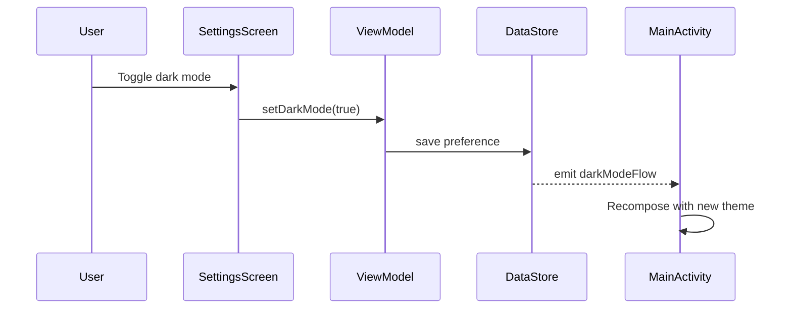
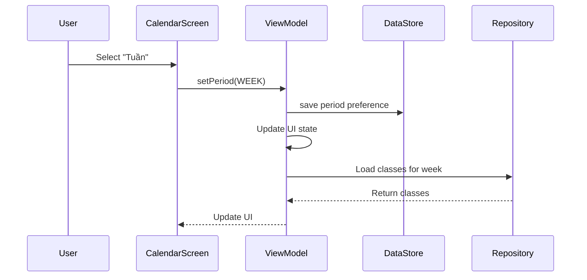
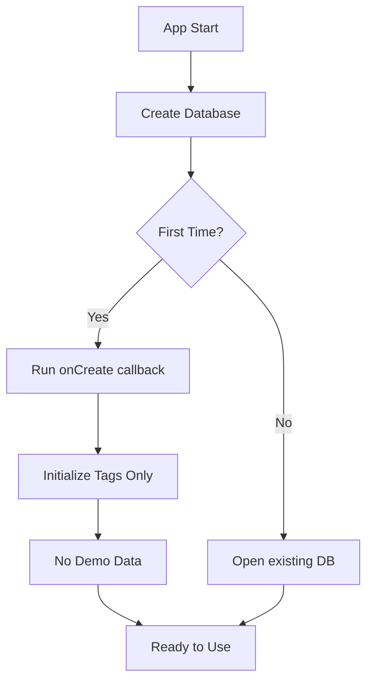

# Design Document

## Overview

Tài liệu thiết kế này mô tả các thay đổi kỹ thuật cần thiết để thực hiện các cải tiến cho ứng dụng quản lý học sinh. Các cải tiến bao gồm loại bỏ dữ liệu demo, sửa lỗi dark/light mode, đơn giản hóa giao diện nhập liệu, và thêm tính năng chọn khung thời gian cho lịch.

## Architecture

Ứng dụng hiện tại sử dụng kiến trúc 3-layer với:
- **UI Layer**: Jetpack Compose screens và components
- **Data Layer**: Room database, DataStore cho preferences
- **Navigation**: Jetpack Navigation Compose

Các thay đổi sẽ được thực hiện trong tất cả các layer này để đảm bảo tính nhất quán.

## Components and Interfaces

### 1. Database Initialization (Loại bỏ dữ liệu demo)

**Affected Files:**
- `StudentManagementDatabase.kt`
- Các Repository classes

**Changes:**
- Xóa logic tạo dữ liệu demo trong `DatabaseCallback.onCreate()`
- Chỉ giữ lại việc khởi tạo các tag mặc định (DailyTag enum)
- Đảm bảo database khởi tạo với schema trống

**Implementation:**
```kotlin
private class DatabaseCallback : RoomDatabase.Callback() {
    override fun onCreate(db: SupportSQLiteDatabase) {
        super.onCreate(db)
        // Only initialize default tags, no demo data
        DailyTag.values().forEach { tag ->
            db.execSQL(
                "INSERT INTO tags (code, displayName) VALUES ('${tag.code}', '${tag.displayName}')"
            )
        }
    }
}
```

### 2. Theme Management (Dark/Light Mode)

**Affected Files:**
- `MainActivity.kt`
- `SettingsScreen.kt`
- `SettingsDataStore.kt`
- `Theme.kt`

**Current Issue:**
- SettingsScreen sử dụng local state (`remember { mutableStateOf() }`) không kết nối với DataStore
- MainActivity không đọc theme preference từ DataStore
- Theme không được áp dụng khi thay đổi setting

**Solution:**
- Tạo SettingsViewModel để quản lý state từ SettingsDataStore
- MainActivity đọc darkMode preference và truyền vào StudentManagementTheme
- SettingsScreen sử dụng ViewModel để đọc/ghi theme preference
- Sử dụng collectAsState() để reactive update UI

**Data Flow:**
```
SettingsScreen -> SettingsViewModel -> SettingsDataStore
                                            ↓
MainActivity -> collectAsState(darkModeFlow) -> StudentManagementTheme
```

### 3. Simplified Class Input (Bỏ Môn học và Ghi chú)

**Affected Files:**
- `ClassEntity.kt`
- `ClassCreateScreen.kt` / `ClassEditScreen.kt`
- `ClassDetailScreen.kt`
- `ClassDao.kt`

**Changes:**
- Giữ nguyên schema database (subject, note vẫn nullable)
- Ẩn UI input cho subject và note trong create/edit screens
- Không hiển thị subject và note trong class detail
- Set giá trị mặc định null khi tạo/sửa class

**Rationale:**
- Giữ schema để tương thích ngược và có thể khôi phục tính năng sau
- Chỉ thay đổi UI layer, không migration database

### 4. Calendar View Enhancements

**Affected Files:**
- `CalendarScreen.kt`
- New: `CalendarViewModel.kt`
- New: `CalendarPeriodSelector.kt` (component)
- `SettingsDataStore.kt` (thêm calendar period preference)

**New Components:**

#### 4.1 CalendarPeriodSelector Component

```kotlin
enum class CalendarPeriod {
    WEEK,   // Tuần
    MONTH,  // Tháng
    YEAR    // Năm
}

@Composable
fun CalendarPeriodSelector(
    selectedPeriod: CalendarPeriod,
    onPeriodChange: (CalendarPeriod) -> Unit
)
```

**Features:**
- Segmented control với 3 options: Tuần, Tháng, Năm
- Lưu selection vào DataStore
- Material 3 design với rounded corners

#### 4.2 Calendar View Modes

**Week View:**
- Hiển thị 7 ngày từ Thứ 2 đến Chủ nhật
- Scroll horizontal để xem tuần trước/sau
- Highlight ngày hiện tại
- Hiển thị các buổi học trong tuần

**Month View (Current):**
- Giữ nguyên implementation hiện tại
- Cải thiện highlight cho ngày hiện tại
- Hiển thị indicator cho ngày có lớp

**Year View:**
- Grid 3x4 hiển thị 12 tháng
- Mỗi tháng hiển thị tên và số buổi học
- Tap vào tháng để xem chi tiết tháng đó
- Highlight tháng hiện tại

#### 4.3 Current Date Highlighting

**Implementation:**
- Sử dụng `LocalDate.now()` để lấy ngày hiện tại
- So sánh với các ngày trong calendar
- Apply special styling:
  - Border color: Primary
  - Background: Primary.copy(alpha = 0.2f)
  - Text: Bold


#### 4.4 Scheduled Classes Display

**For Current Date:**
- Load classes có schedule match với ngày hiện tại
- Hiển thị trong "Buổi học hôm nay" section
- Mỗi card hiển thị:
  - Tên lớp
  - Giờ học (từ scheduleDaysOfWeek và startTimeMinutes)
  - Số học sinh
  - Button để navigate đến ClassDetailScreen

**Data Query:**
```kotlin
// In CalendarViewModel
fun getClassesForDate(date: LocalDate): Flow<List<ClassWithStudents>> {
    val dayOfWeek = date.dayOfWeek.value // 1 = Monday, 7 = Sunday
    return classRepository.getClassesByDayOfWeek(dayOfWeek)
}
```

## Data Models

### SettingsDataStore Extensions

```kotlin
// Add new preference key
private val CALENDAR_PERIOD_KEY = stringPreferencesKey("calendar_period")

val calendarPeriodFlow: Flow<CalendarPeriod> = context.dataStore.data.map { preferences ->
    val periodString = preferences[CALENDAR_PERIOD_KEY] ?: CalendarPeriod.MONTH.name
    CalendarPeriod.valueOf(periodString)
}

suspend fun setCalendarPeriod(period: CalendarPeriod) {
    context.dataStore.edit { preferences ->
        preferences[CALENDAR_PERIOD_KEY] = period.name
    }
}
```

### CalendarViewModel State

```kotlin
data class CalendarUiState(
    val selectedPeriod: CalendarPeriod = CalendarPeriod.MONTH,
    val currentDate: LocalDate = LocalDate.now(),
    val selectedDate: LocalDate = LocalDate.now(),
    val classesForSelectedDate: List<ClassWithStudents> = emptyList(),
    val isLoading: Boolean = false
)
```

## Error Handling

### Database Initialization
- Wrap tag initialization trong try-catch
- Log errors nhưng không crash app
- Hiển thị error message nếu database không khởi tạo được

### Theme Switching
- Fallback về system theme nếu không đọc được preference
- Graceful degradation nếu DataStore không available

### Calendar Data Loading
- Show loading indicator khi fetch classes
- Empty state khi không có lớp nào
- Error state với retry button nếu query fail

## Testing Strategy

### Unit Tests
- SettingsDataStore: test read/write preferences
- CalendarViewModel: test date calculations và filtering
- Repository: test query classes by day of week

### UI Tests
- SettingsScreen: verify theme toggle works
- CalendarScreen: verify period selector changes view
- Verify current date highlighting

### Integration Tests
- End-to-end theme switching flow
- Calendar period persistence across app restarts
- Class scheduling và calendar display consistency


## Implementation Considerations

### Performance
- Calendar calculations should be cached
- Use LazyColumn/LazyRow for scrollable calendar views
- Debounce period selector changes
- Use Flow.distinctUntilChanged() để tránh unnecessary recompositions

### Accessibility
- Ensure calendar dates có proper content descriptions
- Theme toggle có clear labels
- Period selector buttons có adequate touch targets (min 48dp)

### Backwards Compatibility
- Không xóa columns trong database (subject, note)
- Có thể restore tính năng sau nếu cần
- Migration path rõ ràng nếu cần thay đổi schema

### User Experience
- Smooth transitions khi switch calendar periods
- Clear visual feedback cho current date
- Intuitive navigation giữa các time periods
- Persist user preferences across sessions

## Mermaid Diagrams

### Theme Management Flow


### Calendar Period Selection Flow


### Database Initialization Flow


## Migration Notes

Không cần database migration vì:
1. Không thay đổi schema
2. Chỉ thay đổi UI và business logic
3. Existing data vẫn compatible

Nếu cần xóa demo data từ existing installations:
- Có thể thêm migration script để xóa specific demo records
- Hoặc cung cấp "Reset Data" option trong Settings
