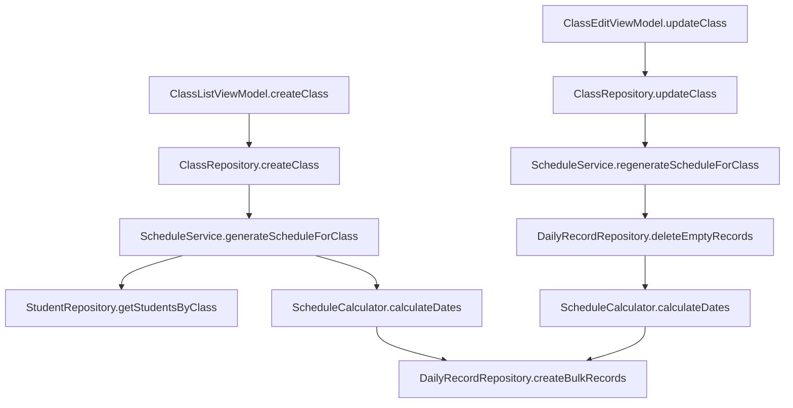

# Design Document

## Overview

Thiết kế này giải quyết 2 vấn đề chính:
1. Tự động tạo lịch điểm danh (DailyRecord) cho học sinh khi tạo/sửa lớp học
2. Thêm icon cho ứng dụng Android

## Architecture

### 1. Schedule Generation System



### 2. Icon Integration

File `student-management-01.png` sẽ được copy vào các thư mục mipmap với các kích thước phù hợp:
- mipmap-mdpi: 48x48
- mipmap-hdpi: 72x72
- mipmap-xhdpi: 96x96
- mipmap-xxhdpi: 144x144
- mipmap-xxxhdpi: 192x192

## Components and Interfaces

### 1. ScheduleService

Service mới để xử lý logic tạo lịch học:

```kotlin
class ScheduleService @Inject constructor(
    private val studentRepository: StudentRepository,
    private val dailyRecordRepository: DailyRecordRepository,
    private val scheduleCalculator: ScheduleCalculator
) {
    suspend fun generateScheduleForClass(classEntity: ClassEntity)
    suspend fun regenerateScheduleForClass(classEntity: ClassEntity)
}
```

**Responsibilities:**
- Lấy danh sách học sinh trong lớp
- Tính toán các ngày học dựa trên lịch
- Tạo DailyRecord cho mỗi học sinh và mỗi ngày học
- Xóa và tạo lại lịch khi cập nhật

### 2. ScheduleCalculator

Utility class tính toán ngày học:

```kotlin
class ScheduleCalculator {
    fun calculateScheduleDates(
        scheduleDaysOfWeek: List<Int>,
        repeatInterval: Int,
        repeatUnit: String,
        startDate: LocalDate = LocalDate.now(),
        monthsAhead: Int = 3
    ): List<LocalDate>
}
```

**Logic:**
- Parse `scheduleDaysOfWeek` từ JSON string
- Tính toán các ngày trong khoảng thời gian (mặc định 3 tháng)
- Xử lý repeatInterval và repeatUnit (WEEK, MONTH, YEAR)
- Trả về danh sách ngày theo format yyyy-MM-dd

**Ví dụ:**
- scheduleDaysOfWeek = [2, 4, 6] (T2, T4, T6)
- repeatInterval = 1
- repeatUnit = "WEEK"
- → Tạo lịch cho mỗi T2, T4, T6 hàng tuần trong 3 tháng

### 3. DailyRecordRepository Enhancement

Thêm các method mới:

```kotlin
suspend fun createBulkRecords(records: List<DailyRecordEntity>)
suspend fun deleteEmptyRecordsByClass(classId: Long)
suspend fun recordExists(studentId: Long, classId: Long, date: String): Boolean
```

### 4. ClassRepository Enhancement

Không cần thay đổi interface, nhưng cần inject ScheduleService để gọi sau khi tạo/cập nhật lớp.

## Data Models

### DailyRecordEntity (existing)

```kotlin
data class DailyRecordEntity(
    val id: Long = 0,
    val studentId: Long,
    val classId: Long,
    val date: String, // yyyy-MM-dd
    val score: Float? = null,
    val note: String? = null,
    val createdAt: Long,
    val updatedAt: Long
)
```

### ClassEntity (existing)

```kotlin
data class ClassEntity(
    val id: Long = 0,
    val name: String,
    val scheduleDaysOfWeek: String, // JSON: [2,4,6]
    val startTimeMinutes: Int?,
    val repeatInterval: Int = 1,
    val repeatUnit: String = "WEEK"
)
```

## Error Handling

### Schedule Generation Errors

1. **Empty student list**: Không tạo record nào, log warning
2. **Invalid schedule data**: Throw IllegalArgumentException với message rõ ràng
3. **Database errors**: Wrap trong try-catch, log error và throw lại
4. **Duplicate records**: Skip silently (check exists trước khi insert)

### Icon Integration Errors

1. **Missing source file**: Build sẽ fail với error message rõ ràng
2. **Invalid image format**: Gradle task sẽ báo lỗi

## Testing Strategy

### Unit Tests

1. **ScheduleCalculator**:
   - Test tính toán ngày với các repeatUnit khác nhau
   - Test với scheduleDaysOfWeek khác nhau
   - Test edge cases (tháng 2, năm nhuận)

2. **ScheduleService**:
   - Mock repositories
   - Test generateScheduleForClass với lớp có/không có học sinh
   - Test regenerateScheduleForClass xóa đúng records

### Integration Tests

1. Test flow tạo lớp học → tự động tạo DailyRecord
2. Test flow sửa lịch → xóa và tạo lại DailyRecord
3. Verify không tạo duplicate records

### Manual Testing

1. Tạo lớp mới với lịch T2, T4, T6 → Kiểm tra DailyRecord được tạo đúng
2. Sửa lịch từ T2, T4, T6 sang T3, T5, T7 → Kiểm tra lịch cũ bị xóa, lịch mới được tạo
3. Kiểm tra icon hiển thị đúng trên các thiết bị khác nhau

## Implementation Notes

### Schedule Generation Timing

- Tạo lịch **sau khi** lớp học được lưu vào database (để có classId)
- Chạy trong coroutine scope của ViewModel
- Không block UI thread

### Performance Considerations

- Bulk insert DailyRecord (1 transaction thay vì nhiều insert riêng lẻ)
- Giới hạn 3 tháng để tránh tạo quá nhiều records
- Có thể thêm background job để tạo thêm lịch khi gần hết 3 tháng

### Icon Asset Management

- Sử dụng Android Image Asset Studio hoặc script để tạo các kích thước
- Đặt file trong `app/src/main/res/mipmap-*` folders
- Update `AndroidManifest.xml` để reference icon mới
