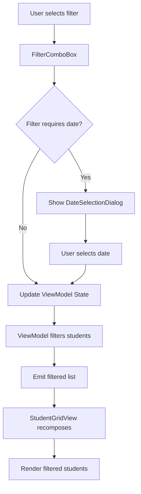

# Design Document

## Overview

Tính năng lọc điểm học sinh được thiết kế để cung cấp một giao diện trực quan và hiệu suất cao cho việc lọc danh sách học sinh dựa trên điểm số trong các ngày học cụ thể. Thiết kế tập trung vào trải nghiệm người dùng mượt mà trên màn hình tần số quét cao (120Hz/144Hz) và tối ưu hóa hiệu suất rendering.

## Architecture

### Component Structure

```
ClassDetailScreen (UI Layer)
    ├── FilterComboBox (New Component)
    │   ├── FilterDropdownMenu
    │   └── DateSelectionDialog
    ├── ResetFilterButton (New Component)
    └── StudentGridView (Modified)
        └── FilteredStudentList

ClassDetailViewModel (ViewModel Layer)
    ├── Filter State Management
    ├── Student Filtering Logic
    └── Performance Optimization
```

### Data Flow



## Components and Interfaces

### 1. FilterType Enum

```kotlin
enum class FilterType {
    ALL,              // Tất cả
    LOW_SCORE,        // Điểm kém (< 7)
    NO_SCORE,         // Chưa có điểm
    PERFECT_SCORE     // Điểm 10
}
```

### 2. FilterState Data Class

```kotlin
data class FilterState(
    val type: FilterType = FilterType.ALL,
    val selectedDate: String? = null  // Format: dd/MM/yyyy
)
```

### 3. FilterComboBox Component

**Purpose**: Hiển thị combo box cho phép chọn tiêu chí lọc

**Props**:
- `currentFilter: FilterState` - Trạng thái filter hiện tại
- `scheduledDates: List<LocalDate>` - Danh sách ngày học đã lên lịch
- `onFilterChange: (FilterType, String?) -> Unit` - Callback khi filter thay đổi

**UI Elements**:
- Dropdown button hiển thị filter hiện tại
- Dropdown menu với 4 options
- Date selection dialog (khi cần)

**Behavior**:
- Khi chọn filter cần date (LOW_SCORE, NO_SCORE, PERFECT_SCORE), hiển thị dialog chọn ngày
- Khi chọn ALL, clear date và áp dụng ngay
- Hiển thị ngày đã chọn trong label nếu có

### 4. DateSelectionDialog Component

**Purpose**: Dialog cho phép chọn ngày từ danh sách scheduled dates

**Props**:
- `scheduledDates: List<LocalDate>` - Danh sách ngày có thể chọn
- `onDateSelected: (String) -> Unit` - Callback khi chọn ngày
- `onDismiss: () -> Unit` - Callback khi đóng dialog

**UI Elements**:
- LazyColumn hiển thị danh sách ngày
- Mỗi item hiển thị ngày theo format dd/MM/yyyy
- Highlight ngày gần nhất với hiện tại

### 5. ResetFilterButton Component

**Purpose**: Nút reset nhanh để xóa filter

**Props**:
- `isVisible: Boolean` - Hiển thị khi có filter active
- `onReset: () -> Unit` - Callback khi click reset

**UI Elements**:
- IconButton với icon Clear/Close
- Chỉ hiển thị khi filterType != ALL

### 6. ClassDetailViewModel Extensions

**New State Flows**:
```kotlin
private val _filterState = MutableStateFlow(FilterState())
val filterState: StateFlow<FilterState> = _filterState.asStateFlow()

private val _filteredStudents = MutableStateFlow<List<StudentEntity>>(emptyList())
val filteredStudents: StateFlow<List<StudentEntity>> = _filteredStudents.asStateFlow()
```

**New Methods**:
```kotlin
fun setFilter(type: FilterType, date: String? = null)
fun resetFilter()
fun applyFilter()
private fun filterStudents(students: List<StudentEntity>, records: Map<Pair<Long, String>, Float?>): List<StudentEntity>
```

## Data Models

### FilterState

```kotlin
data class FilterState(
    val type: FilterType = FilterType.ALL,
    val selectedDate: String? = null
) {
    fun isActive(): Boolean = type != FilterType.ALL
    
    fun getDisplayLabel(): String {
        return when (type) {
            FilterType.ALL -> "Tất cả"
            FilterType.LOW_SCORE -> "Điểm kém${selectedDate?.let { " - $it" } ?: ""}"
            FilterType.NO_SCORE -> "Chưa có điểm${selectedDate?.let { " - $it" } ?: ""}"
            FilterType.PERFECT_SCORE -> "Điểm 10${selectedDate?.let { " - $it" } ?: ""}"
        }
    }
}
```

## Error Handling

### Validation Rules

1. **Date Selection Validation**
   - Chỉ cho phép chọn ngày từ scheduledDates
   - Nếu scheduledDates rỗng, disable filter options cần date

2. **Filter Application**
   - Nếu không có students match filter, hiển thị empty state message
   - Message tùy theo filter type:
     - LOW_SCORE: "Không có học sinh nào có điểm dưới 7 trong ngày này"
     - NO_SCORE: "Tất cả học sinh đã có điểm trong ngày này"
     - PERFECT_SCORE: "Không có học sinh nào đạt điểm 10 trong ngày này"

3. **State Recovery**
   - Nếu filter state invalid (date không tồn tại), reset về ALL
   - Persist filter state trong SavedStateHandle để restore sau khi navigate

## Testing Strategy

### Unit Tests

1. **FilterType Logic Tests**
   - Test filter matching logic cho từng FilterType
   - Test edge cases: null scores, boundary values (6.9, 7.0, 9.9, 10.0)

2. **ViewModel Tests**
   - Test setFilter() updates state correctly
   - Test resetFilter() clears state
   - Test filterStudents() returns correct filtered list
   - Test state persistence

3. **FilterState Tests**
   - Test isActive() logic
   - Test getDisplayLabel() formatting

### UI Tests

1. **FilterComboBox Tests**
   - Test dropdown opens and closes
   - Test all filter options are displayed
   - Test date dialog appears for date-required filters

2. **Integration Tests**
   - Test complete filter flow: select filter → select date → view filtered list
   - Test reset button clears filter
   - Test filter persists across navigation

### Performance Tests

1. **Frame Rate Tests**
   - Measure FPS during filter application on 120Hz/144Hz devices
   - Ensure no frame drops during list filtering
   - Test with large student lists (100+ students)

2. **Recomposition Tests**
   - Verify minimal recompositions when filter changes
   - Test LazyColumn key stability

## Performance Optimization

### High Refresh Rate Support

1. **Animation Optimization**
   ```kotlin
   // Use fast animation specs for high refresh rate
   val animationSpec = spring<Float>(
       dampingRatio = Spring.DampingRatioNoBouncy,
       stiffness = Spring.StiffnessHigh
   )
   ```

2. **Recomposition Minimization**
   ```kotlin
   // Use derivedStateOf for computed values
   val filteredStudents by remember {
       derivedStateOf {
           filterStudents(students, dailyRecords, filterState)
       }
   }
   ```

3. **LazyColumn Optimization**
   ```kotlin
   LazyColumn {
       items(
           items = filteredStudents,
           key = { student -> student.id }  // Stable keys
       ) { student ->
           // Student row composable
       }
   }
   ```

4. **Hardware Acceleration**
   - Enable hardware layer for scrolling containers
   - Use graphicsLayer for transformations
   ```kotlin
   Modifier.graphicsLayer {
       // Hardware accelerated transformations
   }
   ```

5. **State Management**
   - Use StateFlow instead of LiveData for better Compose integration
   - Collect state with collectAsStateWithLifecycle() for lifecycle awareness
   - Avoid unnecessary state updates with distinctUntilChanged()

6. **Background Processing**
   - Perform filtering in background coroutine
   - Use Dispatchers.Default for CPU-intensive operations
   ```kotlin
   viewModelScope.launch(Dispatchers.Default) {
       val filtered = filterStudents(students, records)
       withContext(Dispatchers.Main) {
           _filteredStudents.value = filtered
       }
   }
   ```

### Memory Optimization

1. **Efficient Data Structures**
   - Use Map for O(1) score lookups
   - Avoid creating unnecessary intermediate lists

2. **Lazy Evaluation**
   - Filter students on-demand
   - Don't cache filtered results unnecessarily

## UI/UX Design

### Filter Combo Box Layout

```
┌─────────────────────────────────────┐
│ TopAppBar                           │
│  [Back] Lớp ABC    [Refresh] [▼Filter] [X] [Edit] │
└─────────────────────────────────────┘
```

When filter is active:
```
┌─────────────────────────────────────┐
│ TopAppBar                           │
│  [Back] Lớp ABC    [Refresh] [▼Điểm kém - 15/11/2025] [X] [Edit] │
└─────────────────────────────────────┘
```

### Dropdown Menu

```
┌─────────────────────────┐
│ ✓ Tất cả                │
│   Điểm kém (< 7)        │
│   Chưa có điểm          │
│   Điểm 10               │
└─────────────────────────┘
```

### Date Selection Dialog

```
┌─────────────────────────────┐
│  Chọn ngày                  │
├─────────────────────────────┤
│  15/11/2025 (Hôm nay)       │
│  18/11/2025                 │
│  20/11/2025                 │
│  22/11/2025                 │
│  ...                        │
├─────────────────────────────┤
│         [Hủy]               │
└─────────────────────────────┘
```

### Empty State

```
┌─────────────────────────────────────┐
│                                     │
│         [Filter Icon]               │
│                                     │
│  Không có học sinh nào              │
│  có điểm dưới 7 trong ngày này      │
│                                     │
└─────────────────────────────────────┘
```

## Implementation Notes

1. **Filter Button Placement**: Nút filter đặt trong TopAppBar actions, giữa nút Refresh và Edit
2. **Reset Button**: Chỉ hiển thị khi có filter active, đặt ngay sau filter combo box
3. **Date Format Consistency**: Luôn sử dụng dd/MM/yyyy cho hiển thị, yyyy-MM-dd cho database
4. **Filter Persistence**: Lưu filter state trong SavedStateHandle để restore khi quay lại màn hình
5. **Smooth Transitions**: Sử dụng AnimatedVisibility cho reset button và empty state
6. **Accessibility**: Đảm bảo tất cả interactive elements có contentDescription phù hợp
